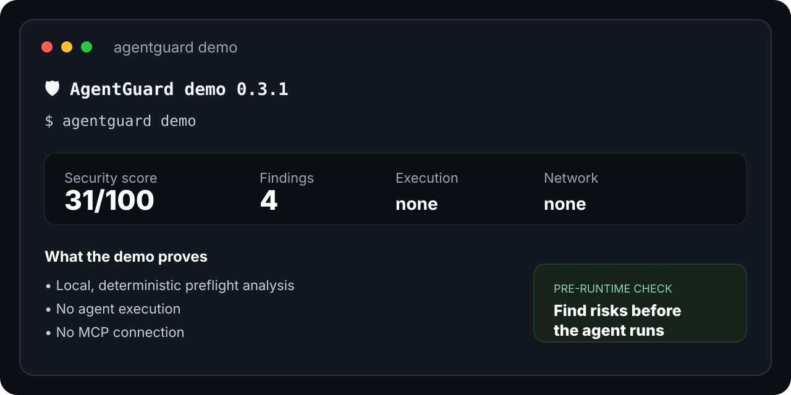

# 🛡️ AgentGuard

**Preflight security scanner for AI-agent configuration and MCP — before the agent runs.**


[](https://pypi.org/project/agentconfigguard/)
[](https://pypi.org/project/agentconfigguard/)


[](https://github.com/atilaamorim/agentguard)

> **Audit your AI agents before they audit your code.**

AgentGuard is an open-source CLI and GitHub Action that scans AI-agent instructions and MCP configuration for high-signal security and policy risks.

**10-second start:** install `agentconfigguard`, run `agentguard demo`, then scan your repository with `agentguard scan .`.

It is **local, deterministic, read-only, and CI-friendly**: normal scans do not invoke agent tools or connect to configured MCP servers.

## Why AgentGuard?

Modern coding agents can read files, run commands, call MCP tools, access secrets, and follow large instruction files. A small configuration mistake can therefore become a security boundary problem.

AgentGuard is the **preflight check** that runs before the agent:

```text
repository
   │
   ├── agent instructions
   ├── MCP configuration
   ├── provider settings
   │
   ▼
┌─────────────────────────────┐
│         AgentGuard          │
│  deterministic local audit  │
└──────────────┬──────────────┘
               │
        findings + score
               │
        ┌──────┴──────┐
        ▼             ▼
      local           CI
      review       GitHub checks
```

## Who is it for?

AgentGuard is useful when an AI coding agent, MCP server, or provider configuration is about to gain access to commands, files, secrets, network services, or external instructions.

Typical workflows:

- **Local review:** `agentguard scan .` before enabling a new agent setup.
- **CI gate:** fail a pull request when a finding reaches a chosen severity.
- **Migration:** introduce a baseline first, then fix newly introduced findings.
- **Provider onboarding:** check Claude, Codex, Cursor, Gemini, OpenCode, and MCP configuration before rollout.

## Try it in 10 seconds

```bash
python -m pip install agentconfigguard
agentguard demo
```

The demo is synthetic and performs **no network access and no file writes**.

Typical demo result:

```text
🛡️ AgentGuard demo 0.3.1
Security score: 31/100
Findings: 4
```

The intentionally risky demo lets a new user verify the scanner immediately without connecting an agent or changing their project.



Then scan a real repository:

```bash
agentguard scan .
```

Useful outputs:

```bash
agentguard scan . --json
agentguard scan . --sarif agentguard-results.sarif
agentguard scan . --html agentguard-report.html
agentguard scan . --adapters
agentguard scan . --context
```

## What it checks

| Rule | Detects | Severity |
| --- | --- | --- |
| `AG-SEC-001` | Credential-like values in tracked config | High |
| `AG-EXEC-001` | Shell / terminal / command-execution capabilities | High |
| `AG-FS-001` | Broad filesystem or workspace access | High |
| `AG-MCP-001` | MCP `trust=true` confirmation bypass | High |
| `AG-MCP-002` | Unencrypted remote MCP `http://` endpoints | Medium |
| `AG-MCP-003` | Remote MCP servers without provenance metadata | Low |
| `AG-POLICY-001` | Untrusted input + private data + outbound actions | Critical |
| `AG-CODEX-001` | Codex full-access + no-approval combination | High |
| `AG-GEMINI-001` | Gemini persistent approval default | Medium |
| `AG-OPENCODE-001` | OpenCode unrestricted shell permission | High |
| `AG-OPENCODE-002` | OpenCode unrestricted edit permission | High |
| `AG-PROMPT-001` | Common prompt-injection patterns | Medium |
| `AG-CONTEXT-001` | Oversized agent instruction files | Low |
| `AG-CONTEXT-002` | Instruction files above a configured context budget | Medium |

Supported agent/config markers include **Claude, Codex, Cursor, Gemini, OpenCode, and MCP**.

## GitHub Actions

Add AgentGuard to any repository:

```yaml
name: AgentGuard

on:
  push:
  pull_request:

jobs:
  audit:
    runs-on: ubuntu-latest
    steps:
      - uses: actions/checkout@v7
      - uses: atilaamorim/agentguard@v0.3.1
        with:
          path: .
          fail-on-severity: "high"
```

The Action can emit:

- GitHub annotations
- JSON
- SARIF
- HTML reports
- CI failure gates

It also supports policy files, baselines, and context budgets.

> **Current stable Action:** `v0.3.1`.

## Policy as code

Keep the security gate with the repository:

```yaml
version: 1
fail_on_severity: high
max_context_tokens: 12000

ignore:
  - rule: AG-MCP-002
    paths:
      - "configs/local/*"
```

AgentGuard discovers `.agentguard.yml` / `.agentguard.yaml` automatically.

## Baselines

Existing repositories can adopt AgentGuard without fixing everything at once:

```bash
agentguard scan . --write-baseline agentguard-baseline.json
agentguard scan . --baseline agentguard-baseline.json
```

Only findings that are not already in the baseline are returned.

## Pre-commit

```yaml
repos:
  - repo: https://github.com/atilaamorim/agentguard
    rev: v0.3.1
    hooks:
      - id: agentguard
```

## Design principles

| Principle | Meaning |
| --- | --- |
| **Local** | No remote service is required for a normal scan |
| **Deterministic** | The same input should produce reproducible findings |
| **Read-only** | The scanner does not execute commands from the project |
| **Explainable** | Findings have stable rule IDs and remediation guidance |
| **Composable** | CLI, CI, SARIF, HTML, policy, and baseline modes can be combined |

## Where AgentGuard fits

AgentGuard is deliberately a **static configuration auditor**, not a runtime firewall.

| Capability | AgentGuard |
| --- | --- |
| Local configuration audit | ✅ |
| MCP trust / transport / provenance checks | ✅ |
| Provider-specific checks | ✅ |
| Dangerous capability-chain checks | ✅ |
| JSON / SARIF / HTML | ✅ |
| GitHub Actions | ✅ |
| Policy-as-code | ✅ |
| Baseline mode | ✅ |
| Runtime tool-call enforcement | ❌ |
| Live MCP probing | ❌ |
| LLM-powered verdicts | ❌ |
| Security certification / guarantee | ❌ |

A clean scan is **not** proof that an agent, MCP server, repository, or deployment is secure. Rules are heuristic and can have false positives or false negatives.

## Security regression benchmark

AgentGuard ships deterministic risky and safe fixtures under `tests/fixtures/`.

Run the suite locally:

```bash
pytest -q
```

Rules should include positive and negative regression coverage whenever practical.

## Documentation

- [Quick start](docs/quickstart.md)
- [Architecture](docs/architecture.md)
- [Threat model](docs/threat-model.md)
- [Rule reference](docs/rules.md)
- [AI Agent & MCP Security Checklist](docs/agent-security-checklist.md)
- [Contributing](CONTRIBUTING.md)
- [Security policy](SECURITY.md)

## Roadmap

- [x] Local filesystem scanner
- [x] JSON/YAML MCP inspection
- [x] Secret detection
- [x] Prompt-injection heuristics
- [x] Permission-risk heuristics
- [x] MCP trust / cleartext HTTP checks
- [x] Dangerous capability-chain detection
- [x] Claude / Codex / Cursor / Gemini / OpenCode detection
- [x] JSON / SARIF / HTML output
- [x] GitHub Action
- [x] GitHub annotations
- [x] Context-cost estimation
- [x] Context budget gate
- [x] Baseline mode
- [x] Policy-as-code
- [x] PyPI package metadata
- [ ] Expand provider-specific coverage
- [ ] Add more safe/risky MCP provenance cases
- [ ] Improve interactive demo and onboarding
- [ ] Add more integrations and examples

## Contributing

Good starting points:

- [#12 — Add more MCP provenance regression cases](https://github.com/atilaamorim/agentguard/issues/12)
- [#13 — Improve AgentGuard demo and onboarding examples](https://github.com/atilaamorim/agentguard/issues/13)

Small, focused pull requests are welcome. New security rules should include regression coverage and remediation guidance.

See [CONTRIBUTING.md](CONTRIBUTING.md) and [the quick start](docs/quickstart.md) before opening a change.

Security issues should follow [SECURITY.md](SECURITY.md).

## License

MIT
